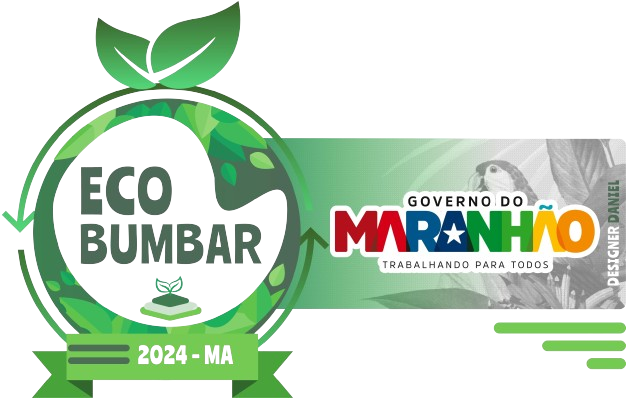
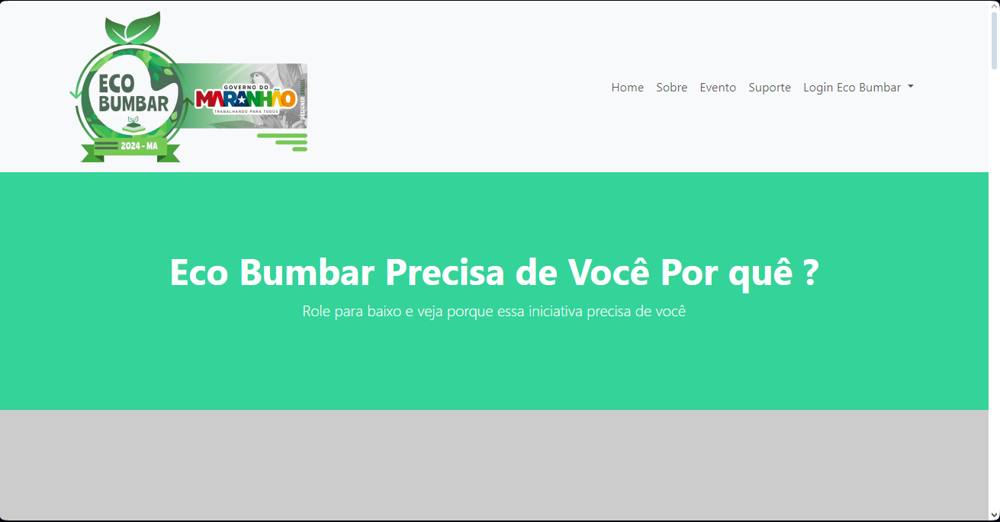
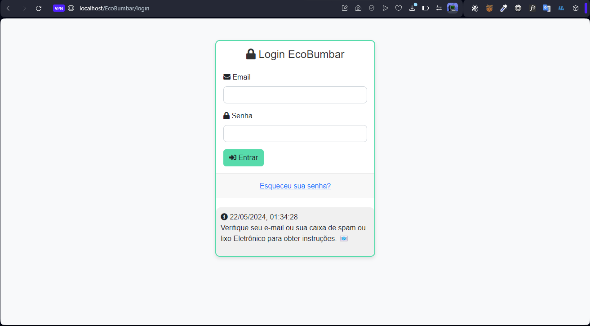
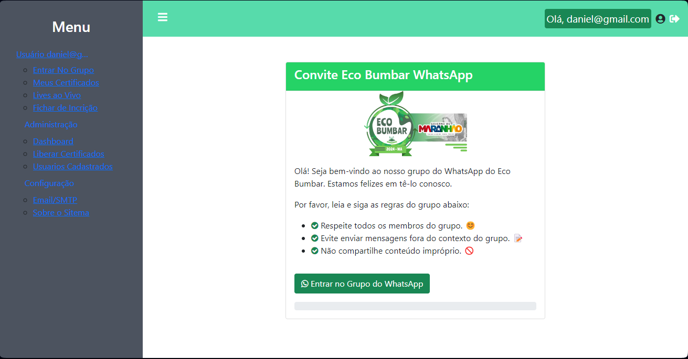

# EcoBumbar




O EcoBumbar é um sistema desenvolvido para o evento de ecologia com o objetivo de fornecer aos usuários acesso a uma plataforma online onde eles podem participar de lives, reuniões no Google Meet e obter certificados de participação.

## Descrição do Projeto

O desafio proposto pela FAPEMA foi criar uma forma de divulgar o projeto, e organizar as cidades, para divulgação do evento EcoBumbar, que trata sobre questões relacionadas à ecologia e sustentabilidade. Para atender a esse desafio, foi desenvolvido um sistema web utilizando PHP, HTML, CSS e JavaScript integrados a um site estático.

## Funcionalidades Usuário

- **Participação em Lives e Google Meet:**
- **Geração de Certificados:**
- **Integração com E-mail:**

## Funcionalidades Admisnitrador
- **Configuração de Email**
- **Troca das Lives / Meet**
- **Liberação de Certificados**
>[!NOTE] 
Dentre outras funcionalidades que o sistema oferece...

- ⚠️ Importante, Baixe a Versão Empacotada para que Funcione no Modo Instalador 
> Link : https://github.com/dvizioon/ECO-BUMBAR/releases/

<table>
  <tr>
    <td align="center">
      <a href="#" >
      
        <br>
        <sub>
          <b>Site</b>
        </sub>
      </a>
    </td>
    <td align="center">
      <a href="#" >
      
        <br>
        <sub>
          <b>Login</b>
        </sub>
      </a>
    </td>
  </tr>
    <tr>
    <td align="center">
      <a href="#" >
      
        <br>
        <sub>
          <b>Painel</b>
        </sub>
      </a>
    </td>

  </tr>

</table>


## Requisitos do Sistema

- **PHP:** Versão 7.4 ou superior.
- **Servidor Web:** Recomendamos Xampp / Wamp / Laragon.
- **Cliente de E-mail:** Para receber os certificados por e-mail, é necessário um cliente de e-mail configurado corretamente no servidor / Obter chave de segurança Hein? https://myaccount.google.com/apppasswords.

## Como Instalar

1. Faça o download ou clone este repositório.
```sh
git clone https://github.com/dvizioon/ECO-BUMBAR.git
```
2. Acesso o install para Instalar o Serviço
```bash
http://localhost/<nome_da_sua_pasta>/install/
```

## Configurações Manuais
3. Opcional configurar o webSMTP
```ini
   [EmailHost]
   Host = smtp.example.com
   Username = seu-email@example.com
   Password = sua-senha
   SMTPSecure = tls
   Port = 587
```

3. Opcional configurar o Connection

```php
<?php
class ConexaoMySQLi
{
    private $conexao;

    public function __construct()
    {
        define('DB_HOST', 'seu_host');
        define('DB_USER', 'seu_usuario');
        define('DB_PASS', 'sua_senha');
        define('DB_NAME', 'seu_banco');

        $this->conexao = new mysqli(DB_HOST, DB_USER, DB_PASS, DB_NAME);

        if ($this->conexao->connect_error) {
            die('Conexão falhou: ' . $this->conexao->connect_error);
        }
    }

    public function getConexao()
    {
        return $this->conexao;
    }
}

// $conexao = new ConexaoMySQLi();
// $db = $conexao->getConexao();


```


## Licença

